<h1 align="center">
  <a href="https://github.com/wazam/fantasy-baseball-buzz">
    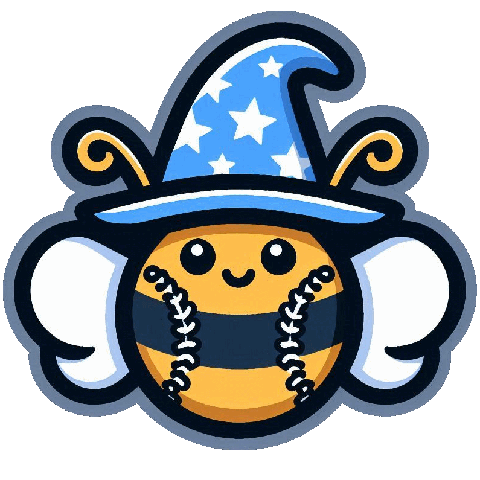
  </a>
  <br/>
  Buzz
</h1>

<p align="center">
  <a href="https://github.com/wazam/fantasy-baseball-buzz/actions/workflows/publish-docker-image.yml">
    
  </a>
  <a href="https://github.com/wazam/fantasy-baseball-buzz/actions/workflows/test-docker-compose-stack.yml">
    
  </a>
  <br />
  <a href="https://github.com/wazam/fantasy-baseball-buzz/releases">
    
  </a>
  
  <a href="https://github.com/wazam/fantasy-baseball-buzz/stargazers">
    
  </a>
</p>

<details><summary><strong>Table of Contents</strong></summary>

- [Overview](#overview)
- [Screenshots](#screenshots)
- [Features](#features)
- [Technologies](#technologies)
- [Installation](#installation)
  - [Option 1: Run via Docker Compose](#option-1-run-via-docker-compose)
  - [Option 2: Build from Source](#option-2-build-from-source)
  - [NocoDB Setup](#nocodb-setup)
  - [Optional Environment Variables](#optional-environment-variables)
    - [Additional NocoDB Environment Variables](#additional-nocodb-environment-variables)
    - [Additional PostgreSQL Environment Variables](#additional-postgresql-environment-variables)
- [Planned Features](#planned-features)
- [Contributing](#contributing)
- [License](#license)
- [Third-Party Platform Terms](#third-party-platform-terms)

</details>

---

## Overview

**Buzz** is a self-hosted fantasy baseball dashboard that aggregates **MLB player trends**, rankings, projections, and social fantasy signals—like **% rostered**, **adds/drops**, and **% started**—from top platforms. It presents a unified, sortable, and filterable view of how players are valued across fantasy leagues, combining social signals with real-life performance metrics and rest-of-season projections.

Rather than forecasting player talent, Buzz reveals how the fantasy community is reacting—surfacing surging pickups, fading names, and platform-specific roster shifts. By tracking this behavior in near real time, you can act on emerging trends before your league does. Whether you're a data-driven GM or just playing the wire, Buzz delivers **fantasy market intelligence** with no third-party logins, no subscriptions, and no fluff.

## Screenshots

| Desktop (Light) | Mobile (Light) |
|-----------------|----------------|
| 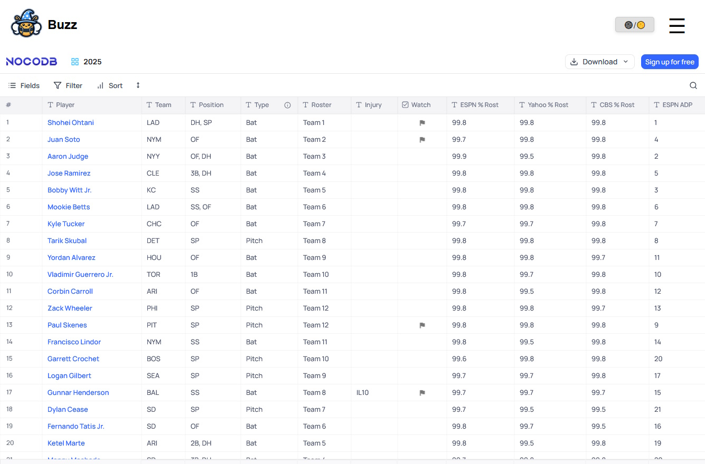<br/>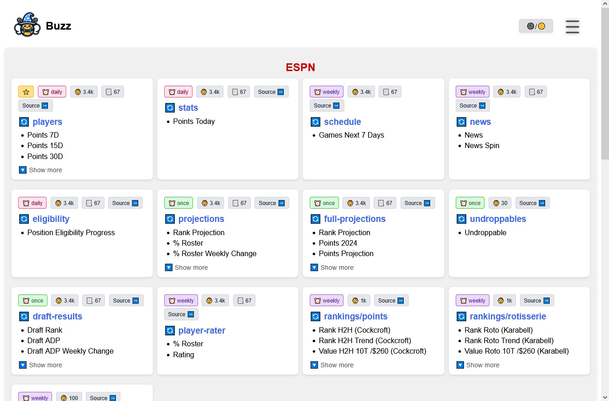<br/>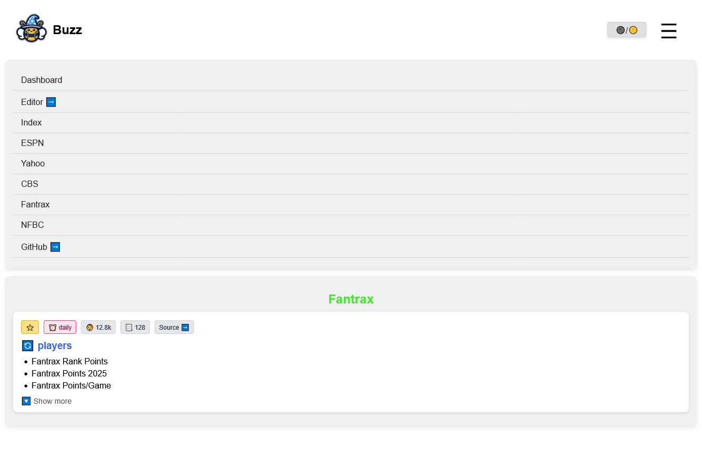 | 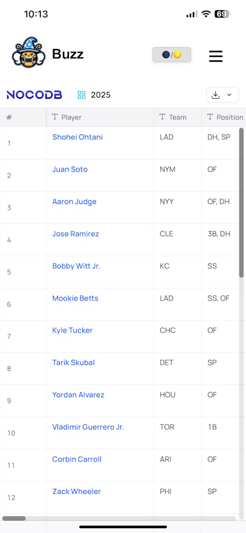<br/>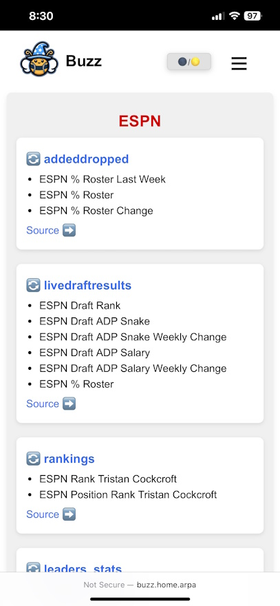<br/>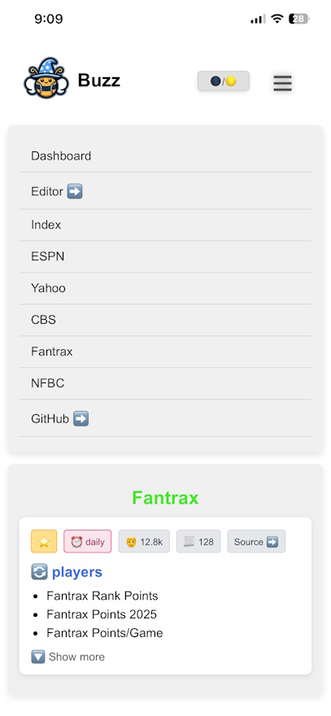 |

| Desktop (Dark) | Mobile (Dark) |
|----------------|---------------|
| 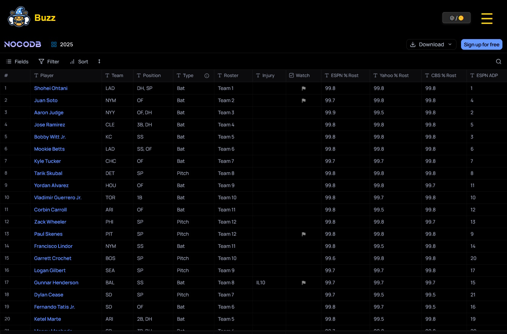<br/>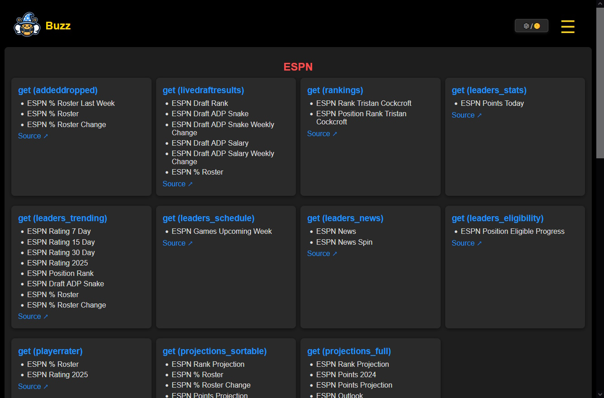 | 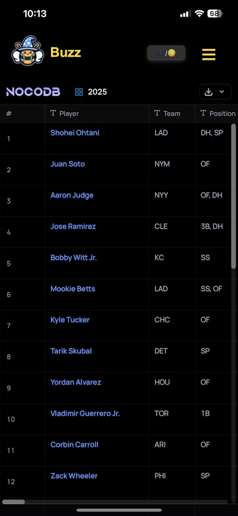<br/>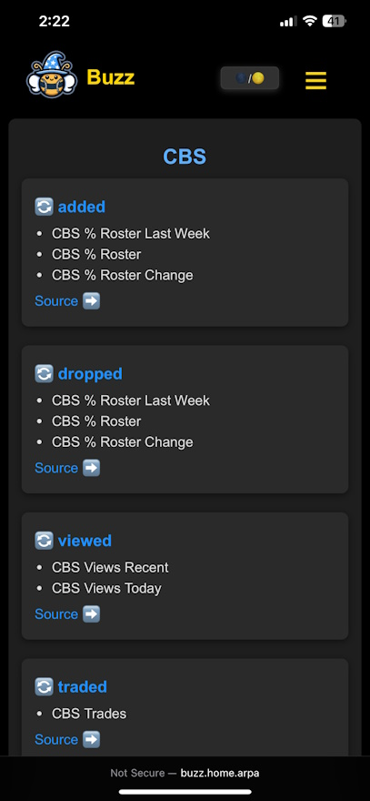 |

## Features

- 📡 **Multi-Source Coverage** — Pulls fantasy player data from multiple popular league platforms for comprehensive tracking.
- 📊 **Unified Player Dashboard** — See every eligible MLB player in a sortable, filterable table with side-by-side comparisons across platforms.
- 🌊 **Fantasy Sentiment Tracking** — Focuses on social signals like ownership trends and transaction volume to reveal shifts in player value before your league reacts.
- 🔥 **Fantasy Valuation Metrics** — Covers projection-based, statistic-based, and opinion-based rankings for various timeframes—preseason, weekly, and rest-of-season—to give a complete picture of a player's value.
- 🔁 **Manual Data Refresh** — Trigger scrapes manually to pull the most up-to-date data directly from each platform—no stale caches or outdated snapshots.
- 🔒 **Fully Self-Hosted** — Runs entirely on your own machine; no third-party accounts, logins, or subscriptions required.
- 📱 **Responsive Design** — Clean UI optimized for desktop and mobile use.
- 🐳 **One-Command Docker Launch** — Spin it up fast with Docker Compose; no complicated setup needed.

## Technologies

- **Language & Runtime:** Python — powered by Flask for the web app, Requests for HTTP, and BeautifulSoup for scraping; managed with Pipenv.
- **Frontend & Templating:** Jinja2 for dynamic HTML, styled with responsive CSS for mobile and desktop support.
- **Database Layer:** PostgreSQL, accessed and managed visually through NocoDB (open-source Airtable alternative).
- **Infrastructure & Deployment:** Containerized with Docker, orchestrated using Docker Compose for seamless local and server-side setup.
- **Automation & CI/CD:** GitHub Actions for testing, building, and publishing Docker images automatically.

## Installation

> [!TIP]
> Option 1 (Docker Compose) is recomended for most users.

### Option 1: Run via Docker Compose

1. **Create `compose.yaml`**

    ```yaml
    services:
      fantasy-baseball-buzz:
        image: ghcr.io/wazam/fantasy-baseball-buzz:latest
        environment:
          - NOCODB_API_TOKEN=your_api_token_here  # 👈 Required
          - NOCODB_TABLE_ID=your_table_id_here    # 👈 Required
          - NOCODB_PUBLIC_ID=your_public_id_here  # 👈 Required
        ports:
          - 5000:5000

      nocodb:
        image: nocodb/nocodb:latest
        restart: unless-stopped
        environment:
          - NC_DB=pg://postgres:5432?u=postgres&p=password&d=postgres
        ports:
          - 8080:8080

      postgres:
        image: postgres:16-alpine
        environment:
          - POSTGRES_PASSWORD=password
        volumes:
          - ./your/path/to/postgres/data:/var/lib/postgresql/data  # 👈 Required
    ```

    > [!IMPORTANT]
    > Replace `/your/path/to/postgres/data` with an absolute path on your local machine. This directory will store your PostgreSQL database files and ensure data persists across container restarts.

2. **Launch the Docker stack**

    ```sh
    docker compose up -d
    ```

3. **Proceed to [NocoDB Setup](#nocodb-setup) section below**

### Option 2: Build from Source

1. **Clone the repository**  
    Download the code and navigate into the project directory:

    ```sh
    git clone https://github.com/wazam/fantasy-baseball-buzz.git
    cd fantasy-baseball-buzz
    ```

2. **Build the Docker image and launch the app**  
    Use Docker to build the image and start the stack:

    ```sh
    docker build -t ghcr.io/wazam/fantasy-baseball-buzz:latest .
    docker compose up -d
    ```

3. **Proceed to [NocoDB Setup](#nocodb-setup) section below**

### NocoDB Setup

> [!NOTE]
> These steps configure NocoDB and generate the required environment values for Buzz.

1. **Access NocoDB**

    Go to [http://localhost:8080](http://localhost:8080) and register as a Super Admin (e.g. `example@anything.whatever` / `mysecretpassword`)

    <details><summary>See Setup Screenshot</summary>

    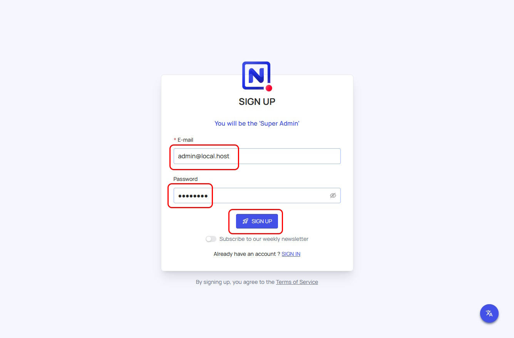

    </details>

2. **Import JSON Template**

    Import [`assets/setup/nocodb-template.json`](assets/setup/nocodb-template.json) as a new table.

    > [!WARNING]
    > Do not delete or rename columns — but feel free to reorder, resize, or hide them in your dashboard

    <details><summary>See Setup Screenshots</summary>

    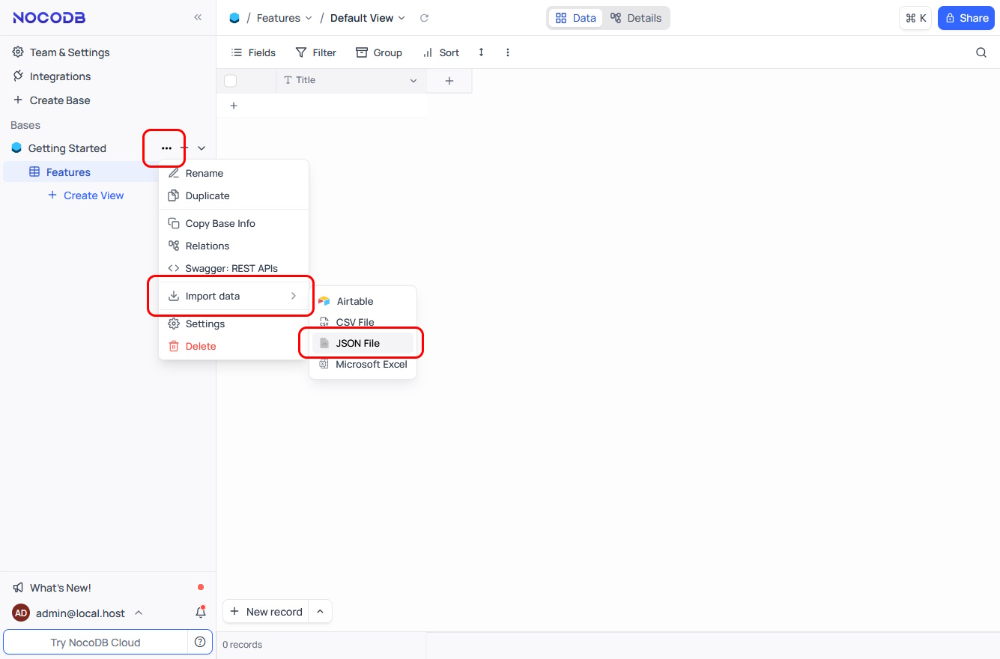
    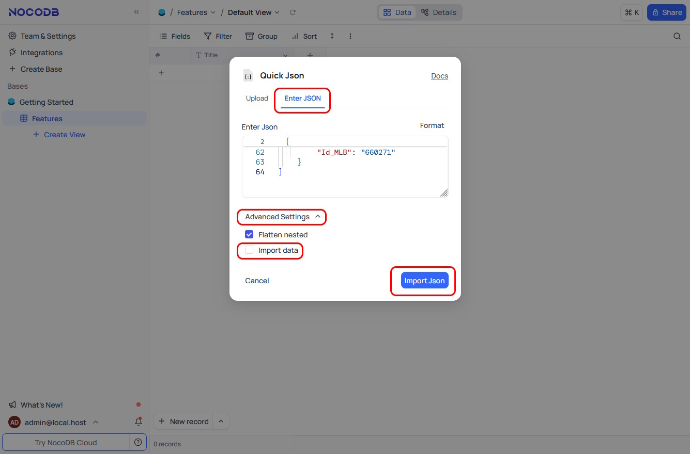
    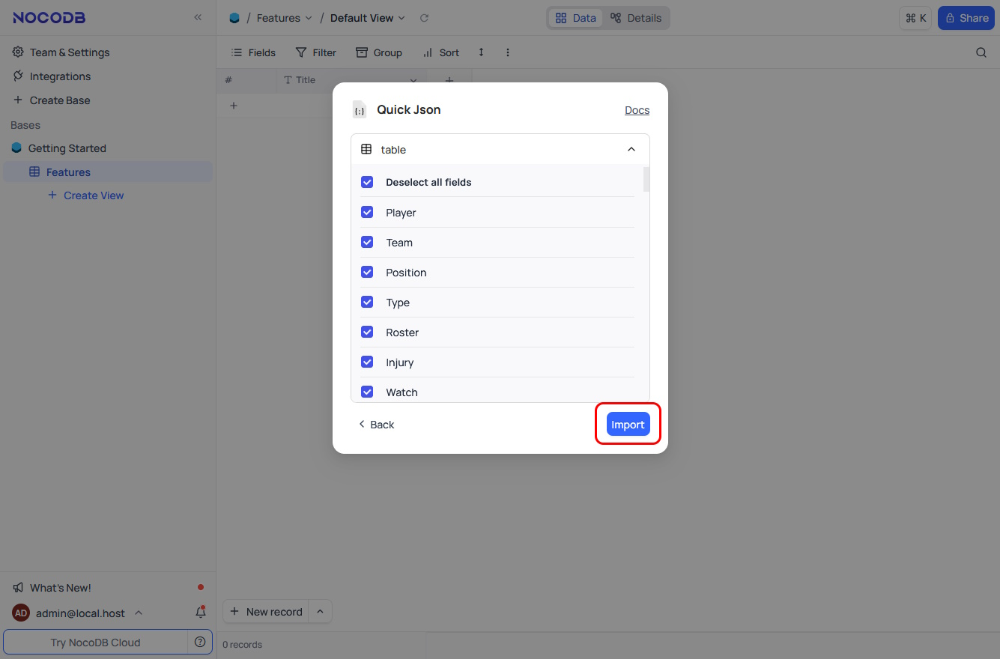

    </details>

3. **Get API Token**

    Go to *Account Settings > Tokens* to generate your personal token and copy it.

    ```yaml
        environment:
          - NOCODB_API_TOKEN=EA_Lcy903zCah6GWiwnWyr6clTF0Alj43KIXuXRG
    ```

    <details><summary>See Setup Screenshots</summary>

    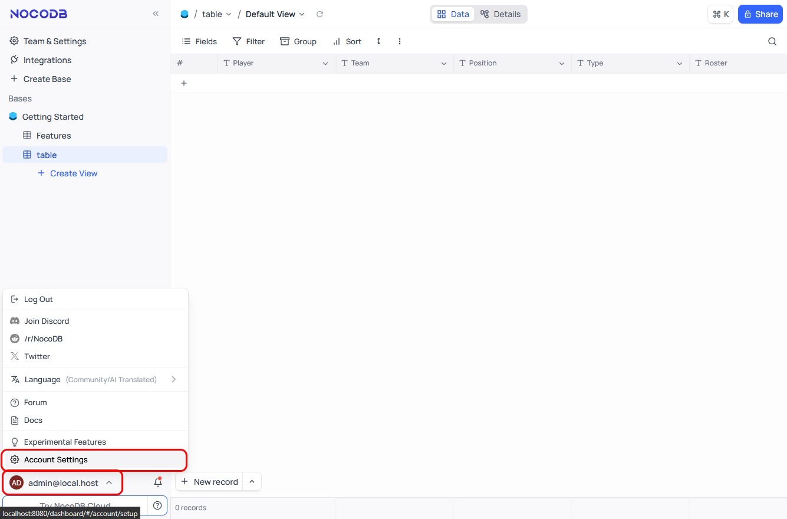
    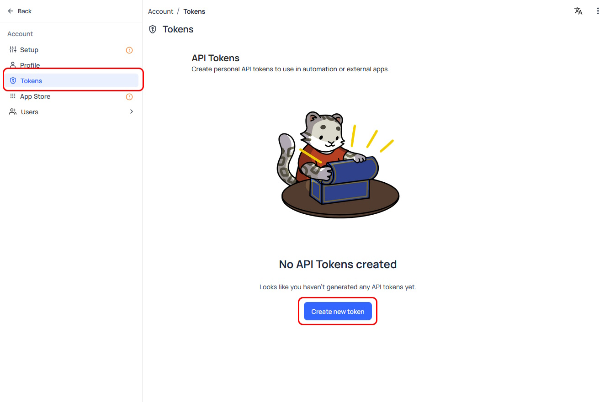
    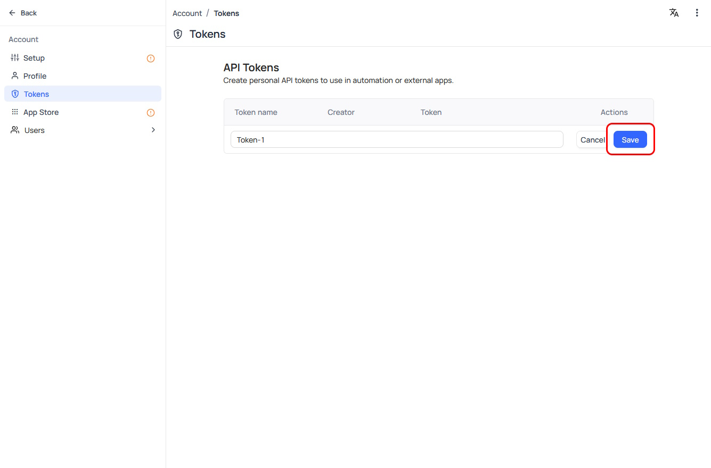
    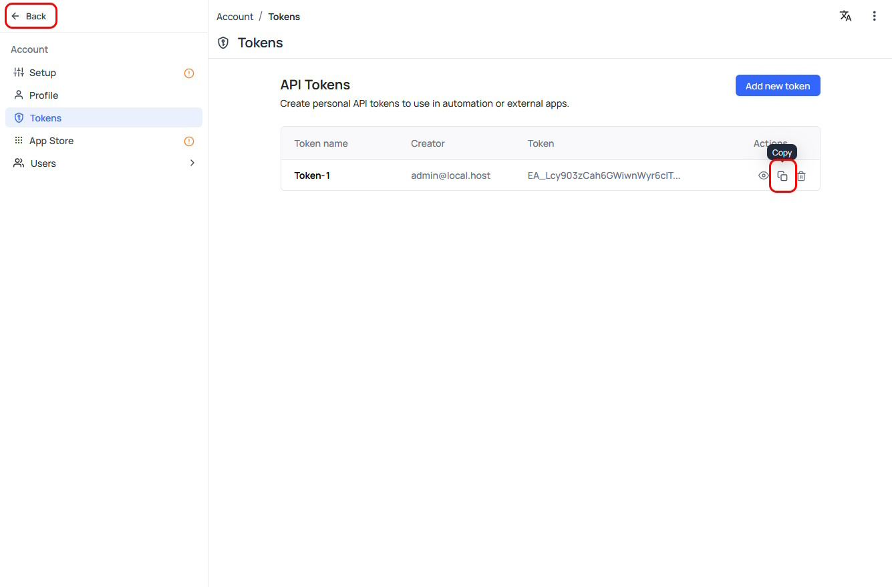

    </details>

4. **Get Base ID and Table ID**

    Navigate to the database view to copy your Base ID and Table ID.

    ```yaml
        environment:
          - NOCODB_BASE_ID=p5qesumr1rzlee2
          - NOCODB_TABLE_ID=m2ghe4zq9dgdzdf
    ```

    <details><summary>See Setup Screenshots</summary>

    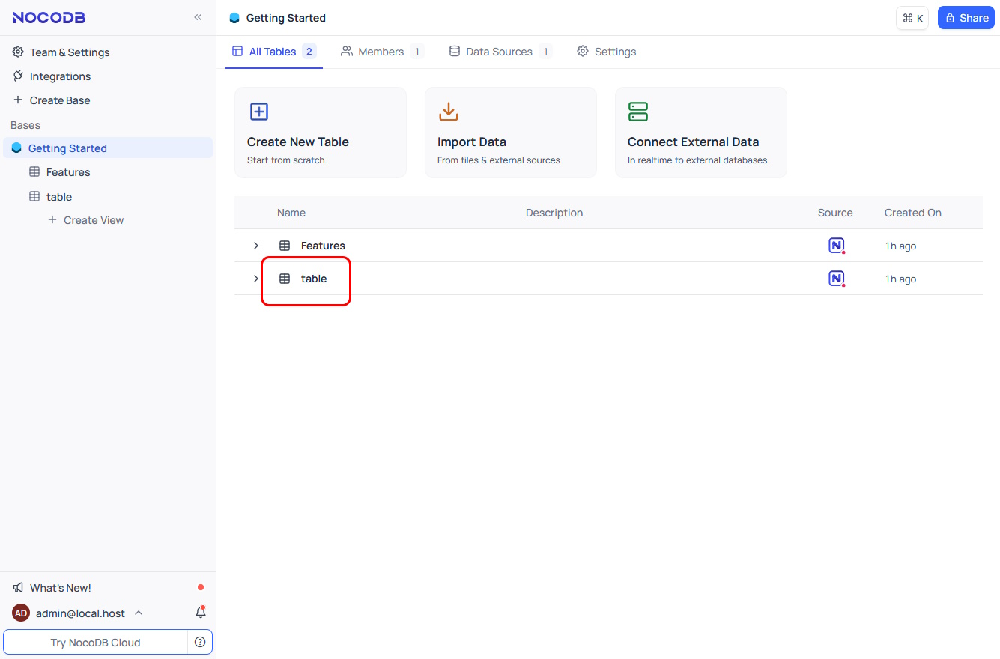
    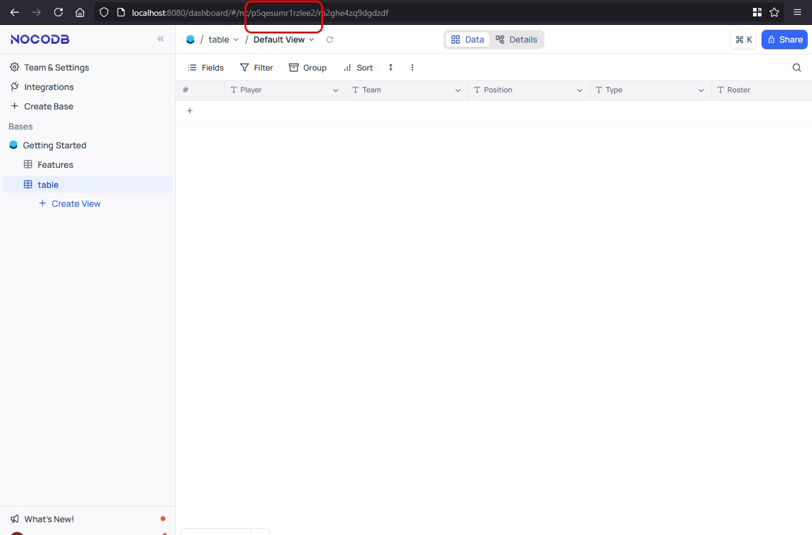
    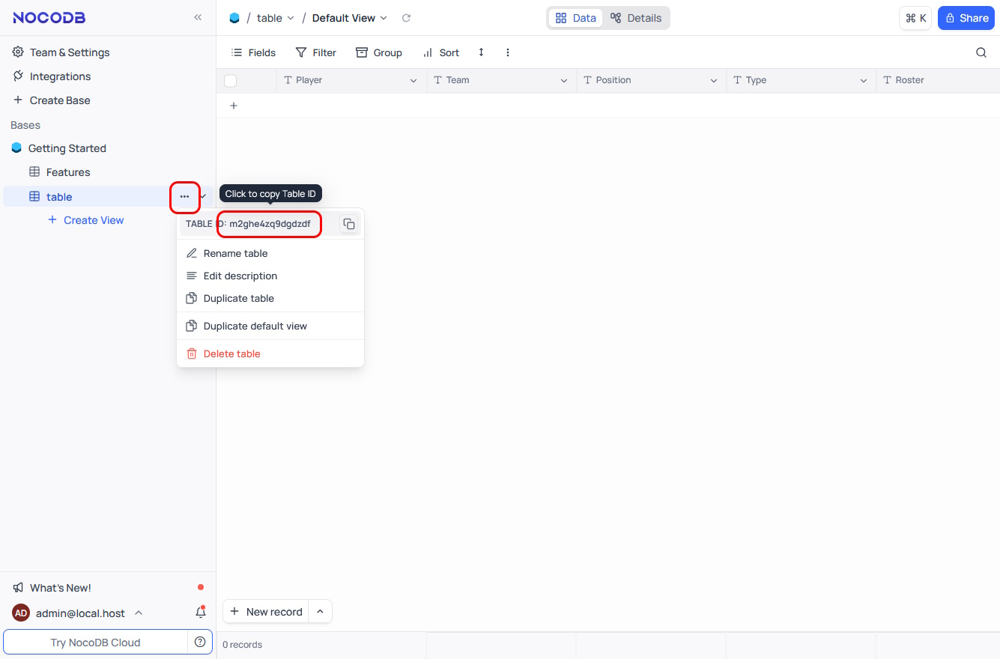

    </details>

5. **Get Public URL and ID**

    Click the **Share** button (top-right corner of table view), enable public viewing, change optional settings, and copy the URL. The raw copy paste has 2 parts you need to parse manually.

    ```yaml
        environment:
          - NOCODB_URL=http://localhost:8080
          - NOCODB_PUBLIC_ID=5b55dc5d-42b9-4aef-b89e-16f104d89b61
    ```

    <details><summary>See Setup Screenshot</summary>

    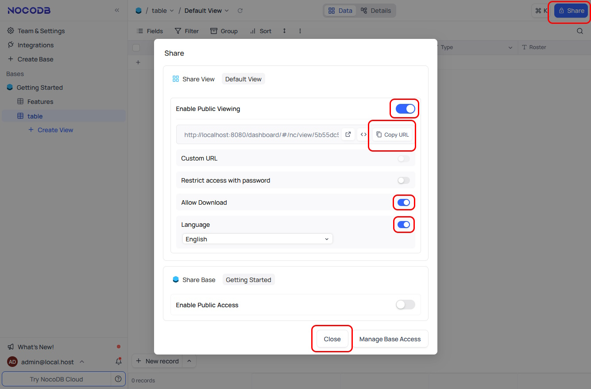

    </details>

6. **Apply Environment Variables**

    Add all the required environment values to your `compose.yaml` file and restart:

    ```sh
    docker compose stop
    docker compose up -d
    ```

7. **Access Buzz**

    Success! Buzz is now connected to your NocoDB instance. Visit and bookmark [http://localhost:5000/](http://localhost:5000/) to begin using **Buzz**.

### Optional Environment Variables

You can enhance Buzz by customizing its behavior using these optional environment variables:

| Variable                | Description                                                                                                                                                                          | Default / Options                                                                                                                |
|-------------------------|--------------------------------------------------------------------------------------------------------------------------------------------------------------------------------------|----------------------------------------------------------------------------------------------------------------------------------|
| `NOCODB_BASE_ID`        | Private ID for the *Base* where the *Table* is. Used to personalize the menu's editor link directly to the user's *Table* for immediate dashboard editing. (already mentioned above) | *`(not set)`* (default), accepts any `string`                                                                                    |
| `NOCODB_URL`            | Public-facing URL for the NocoDB backend. Used to embed the NocoDB dashboard table directly in the Buzz app. (already mentioned above)                                               | `http://localhost:8080` (default), accepts any `string` like `http://192.168.0.10:8080` or `https://nocodb.mysite.com`           |
| `PRIMARY_LEAGUE_SOURCE` | Sets the authoritative fantasy platform for player names, positions, etc. to align the UI with your league's conventions.                                                            | `ESPN` (default), `Yahoo`, `CBS`, `Fantrax`, or `NFBC`                                                                           |
| `LEAGUE_LOGIN_EMAIL`    | Email or username used to fetch rostered players from your private league.                                                                                                           | *`(not set)`* (default), accepts any `string`                                                                                    |
| `LEAGUE_LOGIN_PASSWORD` | Password for the above login.                                                                                                                                                        | *`(not set)`* (default), accepts any `string`                                                                                    |
| `REQUEST_DELAY_SECONDS` | Delay (in seconds) between outbound requests to a platform.                                                                                                                          | `5.5` (default), accepts any `float > 0`                                                                                           |
| `REQUESTS_PER_WINDOW`   | Max number of requests allowed per rate limit window.                                                                                                                                | `1` (default), accepts any `int ≥ 1`                                                                                             |
| `REQUEST_DELAY_MIN`     | Minimum randomized delay (in seconds) before each request.                                                                                                                           | `0.5` (default), accepts any `float > 0`                                                                                         |
| `REQUEST_DELAY_MAX`     | Maximum randomized delay (in seconds) before each request.                                                                                                                           | `1.5` (default), accepts any `float > 0`                                                                                         |
| `TZ`                    | Time zone used for logs and scraping schedules.                                                                                                                                      | `UTC` (docker default), accepts any TZ identifier from [list](https://en.wikipedia.org/wiki/List_of_tz_database_time_zones#List) |

> [!TIP]
> For remote access from another device, set `NOCODB_URL` or the app will only be reachable on `localhost`.
>
> Do not put this on the Internet if you do not know what you are doing.

The `fantasy-baseball-buzz` service does **not** include a health check by default, but you may add one.

```yaml
    healthcheck:
      test: ["CMD", "curl", "-f", "http://localhost:5000/index"]
      interval: 10s
      retries: 5
      start_period: 30s
      timeout: 3s
```

---

#### Additional NocoDB Environment Variables

| Variable                                                                                                  | Description                                                         | Default / Options                                                                                      |
|-----------------------------------------------------------------------------------------------------------|---------------------------------------------------------------------|--------------------------------------------------------------------------------------------------------|
| [`NC_DISABLE_TELE`](https://docs.nocodb.com/getting-started/self-hosted/environment-variables/#telemetry) | Disables the telemetry to prevent sending anonymous usage data.     | *(not set)* (default), `true`                                                                          |
| [`NC DB`](https://docs.nocodb.com/getting-started/self-hosted/environment-variables/#database)            | The primary database where all NocoDB metadata and data are stored. | *(not set)* (default), format: `pg://host.docker.internal:5432?u=username&p=password&d=database_name`. |
| [`PORT`](https://docs.nocodb.com/getting-started/self-hosted/environment-variables/#backend)              | Specifies the network port on which NocoDB will run.                | `8080` (default)                                                                                       |

> [!CAUTION]
> If you're trying to use SQLite instead of PostgreSQL, you must:
>
> - Remove the `postgres` service from `compose.yaml`.
> - Remove the `NC_DB` environment variable entirely.
> - Add a local volume mount for `./your/path/to/nocodb/data:/usr/app/data`.

---

#### Additional PostgreSQL Environment Variables

| Variable                                                                                                       | Description                                              | Default    |
|----------------------------------------------------------------------------------------------------------------|----------------------------------------------------------|------------|
| [`POSTGRES_DB`](https://github.com/docker-library/docs/blob/master/postgres/README.md#postgres_db)             | Name of the default PostgreSQL database                  | `postgres` |
| [`POSTGRES_USER`](https://github.com/docker-library/docs/blob/master/postgres/README.md#postgres_user)         | Username for PostgreSQL authentication                   | `postgres` |
| [`POSTGRES_PASSWORD`](https://github.com/docker-library/docs/blob/master/postgres/README.md#postgres_password) | Password for the specified user (already required above) | `password` |

> [!WARNING]
> If you change any of these defaults, be sure to update the `NC_DB` environment variable for the `nocodb` service in your `compose.yaml` accordingly.

The `postgres` service does **not** include a health check by default, but you may add one to ensure the container is ready before other services attempt to connect.

```yaml
    healthcheck:
      test: ["CMD-SHELL", "pg_isready -U $${POSTGRES_USER} -d $${POSTGRES_DB}"]
      interval: 10s
      timeout: 2s
      retries: 10
```

## Planned Features

- **Roster % Tracking**  
  Monitor player roster percentages across all major platforms.

- **Expanded Roster Imports**  
  Support importing league rosters from Yahoo, CBS, Fantrax, and NFBC using `LEAGUE_LOGIN_EMAIL`.

- **Historical Trend Analysis**  
  Analyze changes in player value over time using archived JSON payloads.

- **Automated Scraping Schedules**  
  Run scraping jobs automatically on a schedule instead of triggering them manually.

## Contributing

Contributions are welcome! Please see the [CONTRIBUTING.md](CONTRIBUTING.md) file for guidelines on how to contribute to this project.

## License

This project is licensed under the MIT License. See the [LICENSE.md](LICENSE.md) file for details.

## Third-Party Platform Terms

Buzz aggregates publicly available fantasy data from the following platforms; please review each site's terms to understand their usage policies:

- [ESPN Terms of Use](https://disneytermsofuse.com/english/)
- [Yahoo Terms of Service](https://legal.yahoo.com/us/en/yahoo/terms/otos/index.html)
- [CBS Terms of Use](https://www.viacomcbs.legal/us/en/cbsi/terms-of-use)
- [Fantrax Terms of Service](https://www.fantrax.com/terms-of-service)
- [NFBC Terms of Service](https://idsrv.fanball.com/terms)
